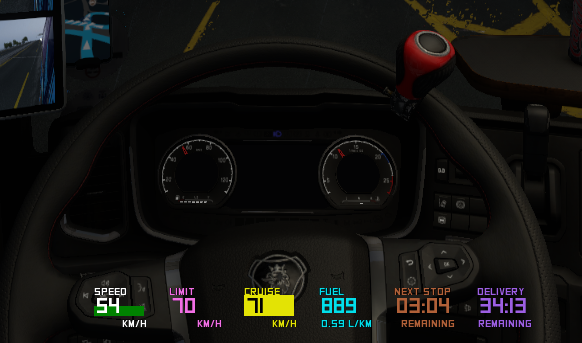

# ETS2/ATS Telemetry Overlay
 Show truck telemetry as game overlay!

✅ Speed with **RPM indicator**!

✅ Speed limit indicator

✅ Cruise control indicator

✅ Fuel level and **liter/km inficator**!

✅ Next stop countdown timer (fatigue)

✅ Job delivery remaining time and **will highlight if running  late**!

✅ Auto hides on game pause!

## Requirements
Download and run [ets2-telemetry-server](https://github.com/Funbit/ets2-telemetry-server) first before as it check for the process Ets2Telemetry.exe and exits automatically if not found.

## Install from Source Code
To install you must have Python 3.9+ and run the following command:

``python -m pip install git+https://github.com/rpfilomeno/ETS2-ATS-Telemetry-Overlay.git``

## Run from Source code
On the command line run:

``python -m truckmon``

## Build Executable
Checkout the source code from git, have Python 3.9+ installed.

### Install the package in the git repository:

``python -m pip install .``

### Install Pyinstaller:

``python -m pip install pyinstaller``

### Build the installer (will create an exe at dist\run_truckmon.exe):

``pyinstaller installer\run_truckmon.py --clean --add-data "truckmon/data/*;truckmon/data" --noconsole --onefile --icon installer\truckmon.ico``

